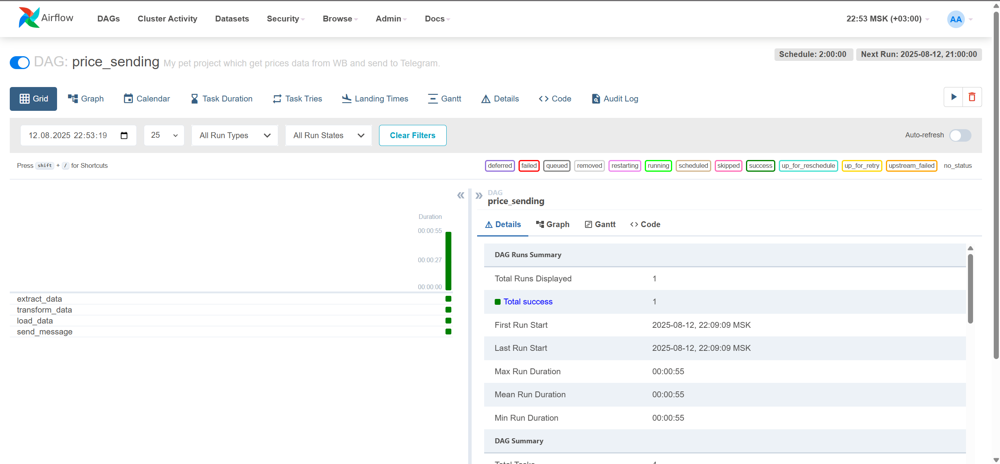
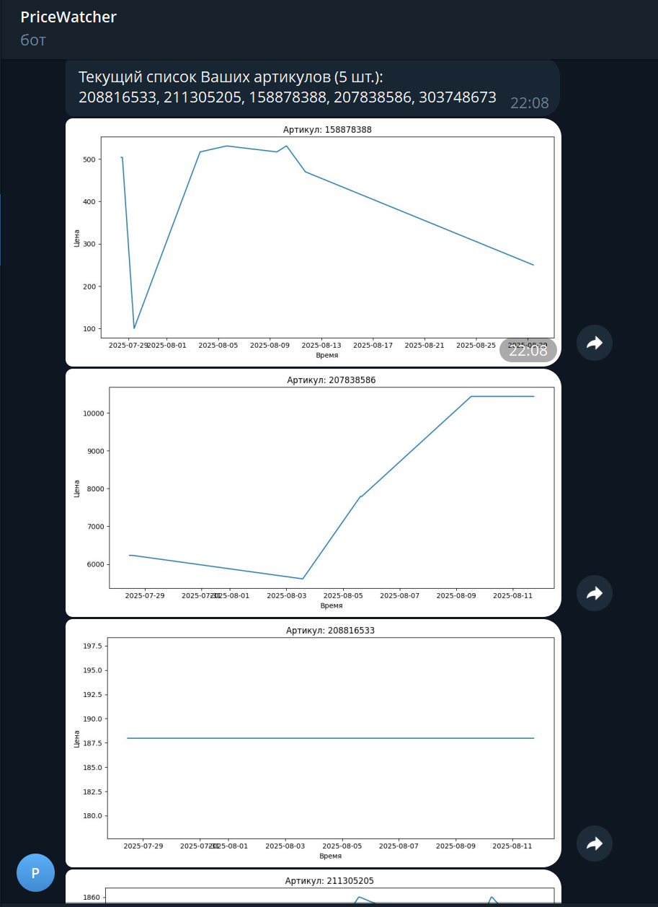
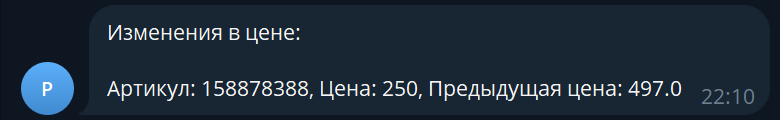
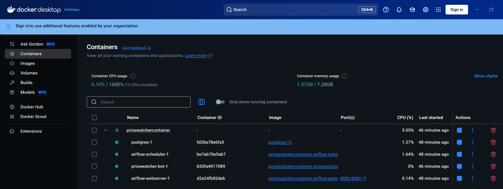

# 🚀 PriceWatcher

**PriceWatcher** — это многофункциональный проект для мониторинга цен на товары с WB и аналитики динамики цен, реализованный на базе Apache Airflow, PostgreSQL и Telegram-бота.

---

## 📋 О проекте

PriceWatcher помогает автоматически собирать и хранить данные о ценах, обновлять их с помощью Airflow DAG’ов и информировать пользователя через Telegram-бота об изменениях. Это не просто парсер, а полноценный аналитический инструмент с надежной инфраструктурой и автоматизацией.

---

## 🛠️ Стек технологий

- **Airflow** — для планирования, управления и автоматизации ETL процессов  
- **PostgreSQL** — надежное хранение исторических данных   
- **Docker & Docker Compose** — для изолированного запуска сервисов и удобства деплоя  
- **Python** — вся бизнес-логика и интеграция с API WB и Telegram  
- **Telegram Bot API** — для оперативных уведомлений и интерактивного управления  

---

## ✨ Ключевые возможности

- Регулярный сбор данных о ценах 

- Исторический анализ изменения цен и построение отчетов  

- Уведомления об изменениях через Telegram   

- Возможность легкого деплоя на любой сервер с Docker  

---

## 📁 Структура репозитория

- `/PriceWatcherContainer/` — докер-композ с Airflow, Postgres, Telegram-ботом и с DockerFile
- `/PriceWatcherContainer/dags/` — Airflow DAG’и для сбора и обработки данных
- `/TGBotContainer/` — скрипты Telegram-бота и его зависимости  
- `/Postgres/` — sql для миграции БД  

---

## ⚙️ Как запустить локально

1. Клонируйте репозиторий:

- git clone https://github.com/yourusername/PriceWatcher.git
- cd PriceWatcher/PriceWatcherContainer

2. Поднимите все сервисы:

- docker-compose up --build

3. Перейдите в Airflow UI по адресу: http://localhost:8080 (логин: airflow / пароль: airflow)

4. Запустите DAG и следите за выполнением задач

5. Для работы Telegram-бота:

- Создайте все необходимые таблицы для работы в БД внутри контейнера Postgres или мигрируйте БД из папки `/Postgres/`
- Убедитесь, что бот настроен на подключение к базе (переменные окружения в docker-compose)
- Запустите контейнер бота вместе с остальными